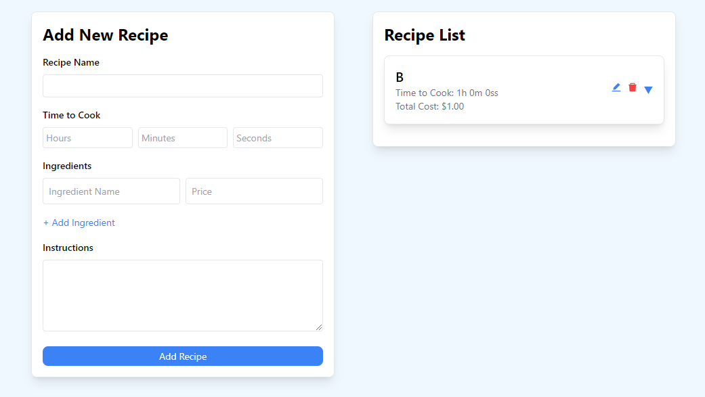

# Recipe Management App

## Overview
The **Recipe Notes App** is a simple web-based application built using React. It allows users to manage recipes by adding, editing, and deleting them. Users can input details like the recipe name, time to cook, ingredients (with their prices), and cooking instructions. The total cost of ingredients is calculated automatically.

This app also integrates with a WordPress site, where users' recipes are saved as WordPress posts through REST API calls. It ensures data persistence by saving recipes locally in the browser and on the WordPress backend.



## Features
- **Add Recipes**: Create new recipes with a name, cooking time, ingredients, and instructions.
- **Edit Recipes**: Modify existing recipes and update them on both the local storage and the WordPress site.
- **Delete Recipes**: Remove recipes from the list and the WordPress site.
- **Local Storage**: Recipes are saved in the browser's local storage, ensuring persistence even after page reloads.
- **WordPress Integration**: Recipes are saved as WordPress posts using the WordPress REST API.

## Technologies Used
- **Frontend**: 
  - React
  - Tailwind CSS (for styling)
  - React Icons (for edit/delete icons)
- **Backend Integration**: 
  - WordPress REST API

## Installation

1. **Clone the Repository**:
   ```bash
   git clone https://github.com/chamukoo/recipe-notes.git
   cd recipe-app
   ```

2. **Install Dependencies**:
   ```bash
   npm install
   ```

3. **Run the Application**:
   ```bash
   npm run dev
   ```

4. **Configure WordPress API**:
   - Make sure your WordPress site is set up with the REST API.
   - Update the `username`, `password`, and API URL in the app's `addRecipe`, `editRecipe`, and `deleteRecipe` functions to match your WordPress site's configuration.

## Usage
- **Adding a Recipe**:
  - Fill in the recipe details (name, time, ingredients, instructions).
  - Click the **Add Recipe** button to save it locally and to your WordPress site.

- **Editing a Recipe**:
  - Click the edit icon next to a recipe.
  - Modify the recipe details and click **Update Recipe** to save changes.

- **Deleting a Recipe**:
  - Click the delete icon next to a recipe to remove it from both local storage and the WordPress site.

## API Configuration
- The app uses **Basic Authentication** to communicate with the WordPress API.
- Update the `username` and `password` in the code when making `POST` or `DELETE` requests to the WordPress API.
  
## Local Storage
Recipes are stored in the browser's local storage, so they persist between page reloads. They are also saved to the WordPress site for more permanent storage.

## Future Improvements
- Add a search/filter feature to quickly find recipes.
- Enable user authentication to manage personal recipes.
- Add image support for recipe posts.
